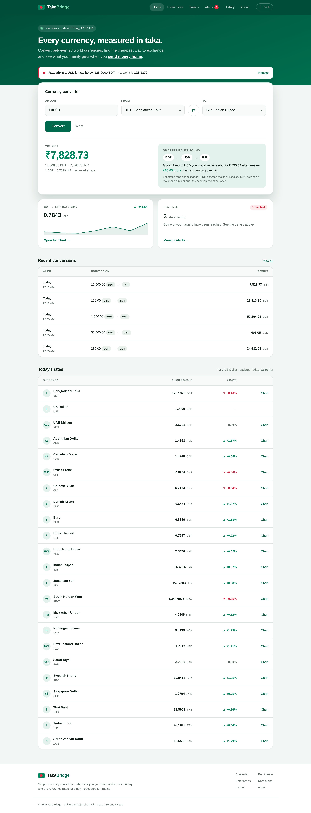
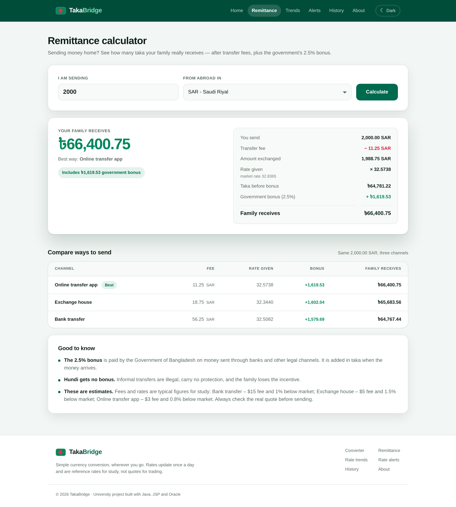
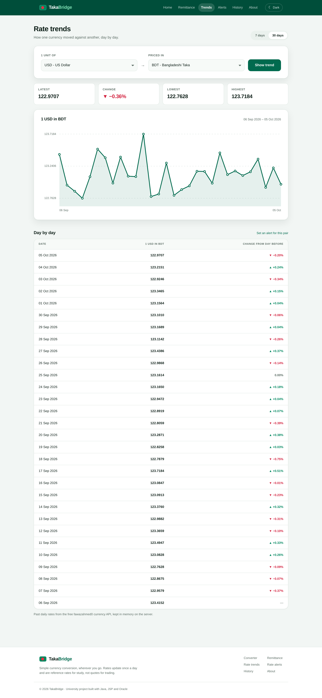
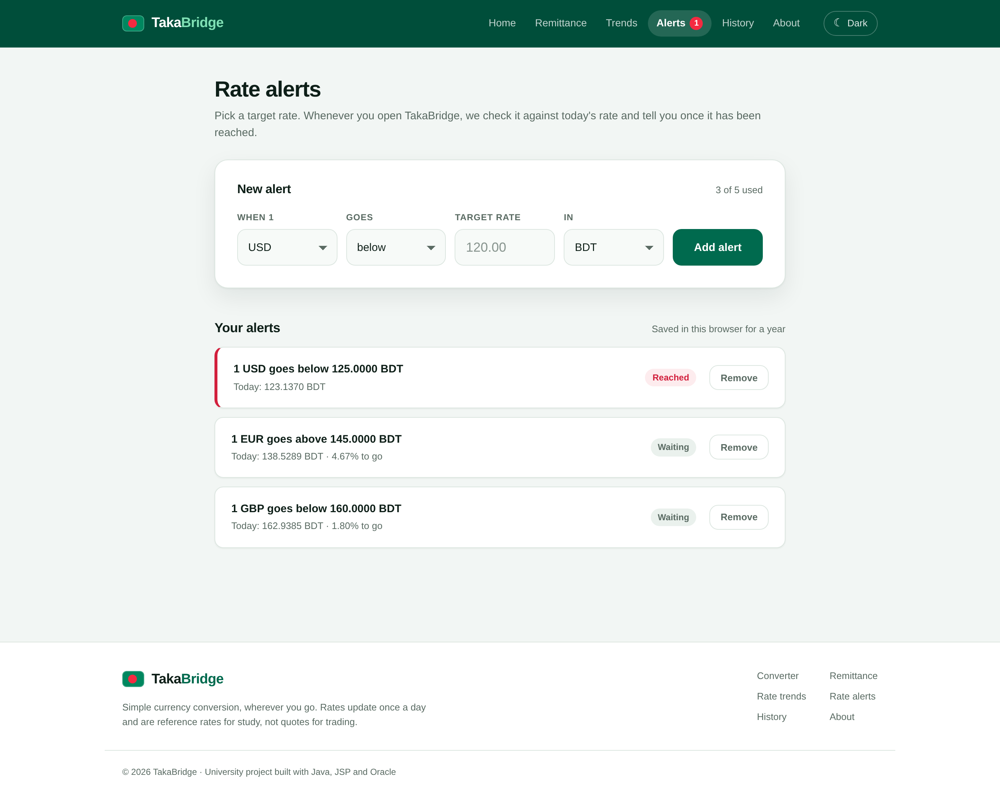
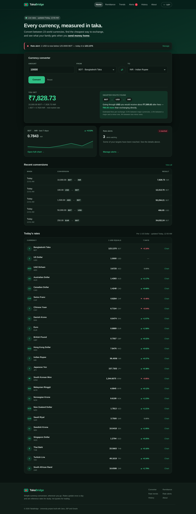

<div align="center">

# 🇧🇩 TakaBridge

**A live currency converter built for Bangladesh — with smart routes, a remittance calculator, rate trends and alerts.**




</div>

## ✨ Features

| | Feature | What it does |
|---|---|---|
| 💱 | **Live converter** | 23 currencies, rates refresh automatically every day |
| 🧭 | **Smart route finder** | Finds the cheapest way to exchange (e.g. BDT → USD → INR beats BDT → INR) |
| 🏠 | **Remittance calculator** | How many taka a family really receives after fees + the 2.5% government bonus |
| 📈 | **Rate trends** | 7- and 30-day charts of any pair, drawn as server-side SVG |
| 🔔 | **Rate alerts** | "Tell me when 1 USD goes below 120 BDT" |
| 🌙 | **Dark mode, history, mobile** | Server-side theme, saved conversions, fully responsive |

## 📸 Screenshots

| Remittance calculator | Rate trends |
|---|---|
|  |  |
| **Rate alerts** | **Dark mode** |
|  |  |

## 🎓 About

University project for **Object Oriented Programming (CSE 2141-0613)**, University of Scholars.

- **Mohammad Abu Yousuf Bhuiyan** — ID 252010277
- **Tasnimul Hasan Efaz** — ID 252010203

Supervised by **Ashif Mahmud Joy**.

---

## 1. What it is built with

| Layer     | Technology                                   |
|-----------|----------------------------------------------|
| Language  | Java (compiles on JDK 21 and JDK 25)          |
| Web layer | Jakarta Servlets + JSP                        |
| Server    | Apache Tomcat 11                              |
| Pages     | HTML5 and hand-written CSS                    |
| Database  | Oracle Database 21c Express Edition (XE), reached via JDBC   |
| Libraries | **One**: `ojdbc17.jar`, the Oracle driver     |

There is **no JavaScript** in this project, no CSS framework, no build tool and
no third-party library other than the Oracle driver. Even dark mode is handled
on the server.

---

## 2. What you need to download

| # | Software | Status | Where |
|---|----------|--------|-------|
| 1 | **JDK** (21 or 25) | already installed | <https://adoptium.net> |
| 2 | **Apache Tomcat 11.0.13** | installed at `C:\tomcat11` | <https://tomcat.apache.org/download-11.cgi> |
| 3 | **ojdbc17.jar** 23.26.3.0.0 | in `WEB-INF/lib` | Maven Central |
| 4 | **Oracle Database 21c XE** | **you must install this** | <https://www.oracle.com/database/technologies/xe-downloads.html> |

Only Oracle is left. It is about 2.2 GB and needs a free Oracle account, so it
cannot be fetched for you. Tomcat never needs installing — it is just an
unzipped folder.

### Before installing: your PC name must differ from your user name

Every Oracle Database installer for Windows fails with this if they match:

```
PRCZ-1082 : Failed to add Windows user or Windows group "NAME" to Windows group "USERS"
O/S-Error: (OS 1387) A member could not be added to or removed from the local group
           because the member does not exist.
```

The installer looks the account up by its bare name. When the computer is
called the same thing as the user, Windows cannot tell which one is meant and
the lookup returns nothing, so the install stops.

Check it:

```
echo %COMPUTERNAME%   and   echo %USERNAME%
```

If they are the same, rename the PC — *Settings → System → About → Rename this
PC* — then restart and run the installer. Nothing else has to change: the user
profile folder, Java, Tomcat and this project are all unaffected.

---

## 3. Set up the database

Double click **`setup-database.bat`** once. It asks for the password you chose
while installing Oracle XE (nothing appears on screen while you type — that is
normal), then runs [`schema.sql`](schema.sql), which:

* creates the database user `takabridge`,
* creates the two tables and the index,
* inserts all 23 currencies.

It finishes by printing a count. **If that count is 23, the database is ready.**

Run it once only; a second run reports that the user and tables already exist.

To do the same by hand, open SQL\*Plus, log in as `system`, and type
`@C:\path\to\schema.sql`.

---

## 4. The Oracle driver

The driver is not stored in this repository. Download **ojdbc17.jar** from
[Maven Central](https://repo1.maven.org/maven2/com/oracle/database/jdbc/ojdbc17/)
and put it here:

```
TakaBridge\src\main\webapp\WEB-INF\lib\ojdbc17.jar
```

It is the only external library in the project.

---

## 5. Check the connection settings

Everything the application knows about the database lives in one file:

```
src\main\java\com\takabridge\util\DBConnection.java
```

It is marked **EDIT HERE**. If you followed `schema.sql` exactly, nothing needs
changing:

```java
URL      = "jdbc:oracle:thin:@localhost:1521/XEPDB1"
USER     = "takabridge"
PASSWORD = "takabridge123"
```

---

## 6. Build and run

**Step 1** — double click **`build.bat`**. It compiles every Java class, copies
the pages next to them, and places the finished application inside Tomcat.
It prints `BUILD OK` when it succeeds.

**Step 2** — double click **`start-tomcat.bat`**. A window opens and stays
open; that window *is* the server.

**Step 3** — open:

```
http://localhost:8080/TakaBridge/
```

To stop the server, close that window or press `Ctrl+C` inside it.

> **Why not Tomcat's own `startup.bat`?** That script needs a `JAVA_HOME`
> system variable. `start-tomcat.bat` finds Java by itself, so nothing on the
> computer has to be configured. Either one works if you do set `JAVA_HOME`.

> If you unzipped Tomcat somewhere other than `C:\tomcat11`, change the
> `CATALINA_HOME` line at the top of both `.bat` files.

After changing any Java or JSP file, run `build.bat` again and restart the
server.

### Moving the project to another computer

Copy one folder holding both of these side by side:

```
TakaBridge-Project/
├── TakaBridge/      the project
└── tomcat11/        a plain copy of the Tomcat folder
```

`build.bat` and `start-tomcat.bat` look for Tomcat in `%CATALINA_HOME%`, then
inside the project folder, then next to it, then `C:\tomcat11` — so a copy made
this way runs with no paths to edit. About 45 MB in total.

On the new machine: install a JDK, check that the PC name differs from the user
name (see section 2), install Oracle XE, then run `setup-database.bat`,
`build.bat` and `start-tomcat.bat` in that order. No data has to be migrated —
`setup-database.bat` recreates the currencies, and history is per browser
session anyway.

### Running it from Eclipse instead

Eclipse IDE for Enterprise Java works too. Add Tomcat 11 under
*Window → Preferences → Server → Runtime Environments*, import the project,
then *Run As → Run on Server*.

---

## 7. Project structure

```
TakaBridge/
├── schema.sql                 Oracle tables and seed data
├── setup-database.bat         creates the database (run once)
├── build.bat                  compiles and deploys to Tomcat
├── start-tomcat.bat           starts the server
└── src/main/
    ├── java/com/takabridge/
    │   ├── model/             Currency, Conversion, Route, Trend, RateAlert,
    │   │                      Remittance
    │   ├── util/              DBConnection, MoneyFormatter, Html, AlertCookie
    │   ├── dao/               CurrencyDAO, HistoryDAO
    │   ├── service/           ConversionService, ValidationException,
    │   │                      LiveRateClient (today's rates),
    │   │                      RateHistoryClient (past rates for charts),
    │   │                      RouteFinder (cheapest exchange route),
    │   │                      RemittanceCalculator (money sent home)
    │   ├── listener/          DailyRateUpdater (refreshes rates in the background)
    │   └── servlet/           Home, Convert, Remittance, Trends, Alerts, History,
    │                          ClearHistory, About, Theme, Base, Flash
    └── webapp/
        ├── index.jsp          forwards to /home
        ├── css/style.css      the only stylesheet
        └── WEB-INF/
            ├── web.xml
            ├── lib/           ojdbc17.jar goes here
            └── views/         index, remittance, trends, alerts, history, about,
                               clear-history, error, header, footer
```

---

## 8. How one request travels — for the viva

Converting 100 USD to BDT:

1. **Browser** — the form on `index.jsp` posts `amount`, `from` and `to`
   to `/convert`.
2. **ConvertServlet** — reads the three values. It does no arithmetic of its
   own; it asks the service layer.
3. **ConversionService** — validates the input, then fetches both currencies
   through `CurrencyDAO` and calculates
   `rate = rate of BDT ÷ rate of USD`, `result = amount × rate`, using
   `BigDecimal` so no paisa is lost.
4. **HistoryDAO** — saves the finished conversion into
   `CONVERSION_HISTORY` with a `PreparedStatement`.
5. **Oracle** — stores the row and returns.
6. **Redirect** — the servlet puts the result in the session and redirects the
   browser to `/home`. This is the Post / Redirect / Get pattern, and it is
   why pressing F5 afterwards never records the same conversion twice.
7. **HomeServlet** — reads the result, loads the currency list and the last
   five conversions, and forwards to the JSP.
8. **index.jsp** — draws the page. It contains no SQL and no calculation, only
   display.

### Object-oriented ideas on show

* **Encapsulation** — `Currency` and `Conversion` keep every field private and
  expose them only through getters and setters.
* **Inheritance** — every servlet extends `BaseServlet`, which holds the
  behaviour they all share: the theme, the character set and how a view is
  opened.
* **Layering** — servlets never touch the database, DAOs never calculate, and
  JSPs never do either. Each class has one job.
* **CRUD** — create (`HistoryDAO.save`), read (`findAll`, `findRecent`),
  delete (`deleteBySession`).

### The smart features — none of them needs a new table

**Smart route finder** (`RouteFinder`). Exchange houses charge more for
rarely traded pairs. TakaBridge uses three estimated fee levels per exchange:
0.5% between two major currencies (USD, EUR, GBP, JPY, CHF, CAD, AUD), 1.5%
between a major and a minor one, and 4% between two minor ones. It tries the
direct route and all 21 routes with one stop in between, and shows the one that
leaves the most money. Example: 10,000 BDT to INR directly loses 4%, but
BDT → USD → INR loses only about 3%, so the app suggests going through the dollar.
This is a small shortest-path search where the "distance" is the fee.

**Rate trends** (`RateHistoryClient`, `Trend`, `TrendsServlet`). Past daily
rates come from the free fawazahmed0 currency API, one file per day. A past
day never changes, so each one is downloaded once and kept in a
`ConcurrentHashMap` in memory. Missing days are downloaded in parallel. The
background thread preloads the last 30 days when Tomcat starts. `Trend` turns
the numbers into SVG coordinates, and `trends.jsp` draws the line chart, so
there is still no JavaScript. Hovering a dot shows the browser's own tooltip.

**Rate alerts** (`RateAlert`, `AlertCookie`, `AlertsServlet`). "Tell me when
1 USD goes below 120 BDT." Up to five alerts are stored in a cookie in the
visitor's own browser, for example `USD:BDT:B:120~EUR:BDT:A:140`. Each part
is checked again when the cookie is read back, so an edited cookie cannot break
anything. On every visit the alerts are compared with today's rates. A reached
alert shows a banner on the home page and a red badge in the menu.

**Remittance calculator** (`RemittanceCalculator`, `RemittanceServlet`). It shows
how many taka a family in Bangladesh really receives. Each channel costs money
in two ways: a flat fee and an exchange rate slightly below the market rate.
The Government of Bangladesh then adds a 2.5% cash incentive for money sent
through legal channels. The calculator works through it like a receipt:

```
amount sent - transfer fee           = amount exchanged
amount exchanged x channel's rate    = taka before bonus
taka before bonus + 2.5% bonus       = what the family receives
```

It compares three typical channels side by side: bank transfer ($15 fee, 1%
below market), exchange house ($5, 1.5%) and online app ($3, 0.8%). It picks
the best one and warns when a transfer is above USD 5,000, because banks
usually ask for documents for the bonus above that amount. The fees are study
estimates kept in one `enum`. The form uses GET because nothing is saved, so a
result can be bookmarked, for example `/remittance?from=SAR&amount=2000`.

All of them share one formula, `ConversionService.crossRate()`, so the
converter, the routes and the alerts can never disagree.

### How dark mode works without JavaScript

The toggle in the header is an ordinary link to `/theme`. `ThemeServlet` flips
the stored value, writes it into a cookie that lasts a year, and redirects the
visitor back to the page they were reading. The JSP then writes
`<body class="dark">` or `<body class="light">`, and the stylesheet redeclares
its colour variables under `body.dark`. Nothing runs in the browser.

---

## 9. If something goes wrong

| Message | What to do |
|---------|-----------|
| `ORA-12541: TNS:no listener` | The listener is stopped. Open `services.msc` and start **OracleOraDB21Home1TNSListener**, and **OracleServiceXE**. |
| `ORA-12514: listener does not currently know of service` | The database is not called `XEPDB1`. Run `SELECT name FROM v$pdbs;` as `system` and use the name it prints. |
| `ORA-01017: invalid username/password` | The password in `DBConnection.java` does not match Part 1 of `schema.sql`. |
| "The Oracle JDBC driver was not found" | `ojdbc17.jar` is not in `WEB-INF\lib`. Copy it there and run `build.bat` again. |
| `ORA-00942: table or view does not exist` | Part 2 of `schema.sql` has not been run, or it was run as the wrong user. |
| `javax.servlet cannot be resolved` | Something was changed to `javax`. Tomcat 11 needs `jakarta.servlet`. |
| Port 8080 already in use | Edit `C:\tomcat11\conf\server.xml` and change port `8080` to `8081`. |
| Changes do not appear | Run `build.bat` again, then restart Tomcat. |

---

## 10. A note on the rates

The rates update themselves once a day. When TakaBridge starts, a background
thread (`listener/DailyRateUpdater.java`) downloads the latest rates from the
free ExchangeRate-API feed (<https://open.er-api.com/v6/latest/USD>, no account
or key needed) and saves them into the `CURRENCIES` table in one transaction.
It then checks every hour and downloads again once the rates are a day old.

If the computer is offline, nothing breaks: the last saved rates are used and
the download is retried an hour later. The home page shows when the rates were
last updated.

These are daily reference rates, not the exact rate a bank or exchange house
will give, so TakaBridge should not be used to price a real transaction.

---

*University project — Java, JSP, HTML, CSS and Oracle.*
